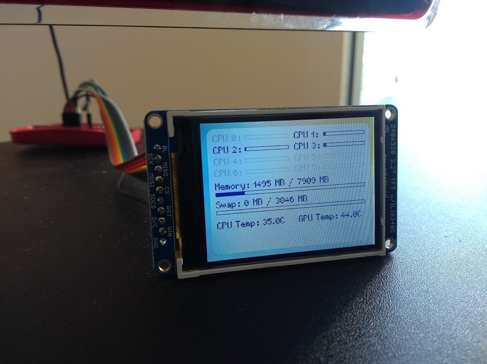

# dquickstat

Remote system statistic monitor for Raspberry Pi.

Client runs on the monitored machine, and sends statistics to Raspberry Pi with a 320x240 framebuffer-enabled screen.

Server will turn screen backlight off when monitored machine is off. 
Uses port TCP 4020.

## Server installation

This should be done on the Pi.

Checkout [fbmagic](https://github.com/djandries/fbmagic) in the parent directory and `make` it.
Run `make` and `sudo make install` in the `server` directory. A systemd service will be installed, and will start at boot.

## Client installation

This should be done on the monitored machine.

Run `make` and `sudo make install` in the `client` directory. A systemd service will be installed, and will start at boot.

Open `/etc/systemd/system/dquickstat-client.service`, remove the IP address in the ExecStart property and replace it with the IP address of the Pi. Restart the service.